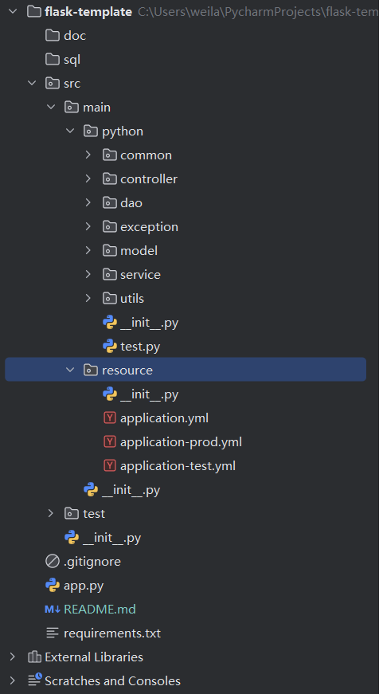

    

<h1 align="center">Flask-Template</h1>

<strong>基于Python的Flask框架构建的Web开发模板 模仿SpringBoot的代码结构和风格，让Java程序员无缝衔接到Python的Web应用开发 <em>持续更新 ing～</em></strong>

    
    
    

## 项目介绍

Flask-Template是一个基于Python的Flask框架编写的模仿SpringBoot风格的Web开发模板，项目进行严格的目录结构划分，包括但不限于对通用结果的封装，全局异常处理，通用工具的封装，配置读写等等。。。

- 项目目录结构

## 模板特点
### 技术栈 & 特性
- Flask
- MySQL
- 全局异常处理器
- 自定义错误码
- 封装通用响应类
- 多环境配置